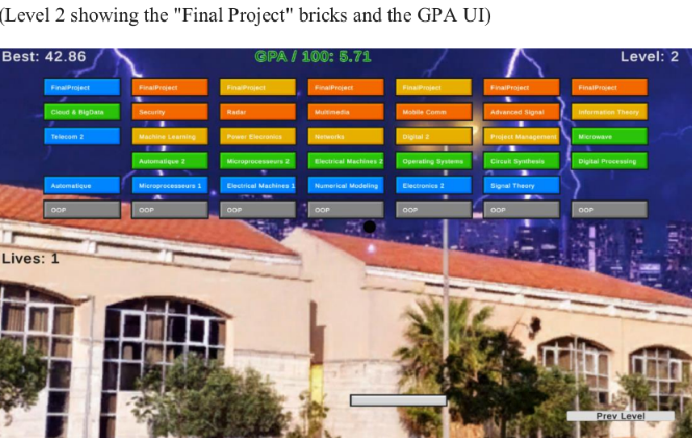

# 🏛️ ULFG Brick Breaker

**Developed by:** Imad Albekai 
**Project Type:** 2D Arcade Game (Unity)

---

## 📝 Overview
This is a custom-built Brick Breaker game featuring a personalized theme based on my university campus. The game challenges players to clear rows of bricks while managing lives and aiming for the high score, all set against a stylized backdrop of the university.

## 🚀 Key Features
* **Persistent Scoring:** High scores are saved locally using JSON serialization, ensuring your records are kept between sessions.
* **Dynamic Level Loading:** Multiple levels with increasing difficulty and unique brick patterns.
* **Custom Graphics:** Features a cartoon-stylized version of the university campus assets.
* **Responsive UI:** Built with a flexible Canvas system to work on various screen resolutions.

## 🎮 How to Play
1. **Launch:** Open the `exe file` from the release folder, in the Releases section.
2. **Controls:** Use your **Arrows** to move the paddle left and right.
3. **Objective:** Bounce the ball to destroy all bricks. Don't let the ball fall!
4. **Lives:** You start with **5 lives**. 

## 📸 Gameplay

---

## 🛠️ Technical Details
* **Engine:** Unity 2022.x+
* **Data Persistence:** Uses `Application.persistentDataPath` for `highscore.json`.
* **Architecture:** Implements a Singleton GameManager for stable data management across scenes.
* **UI Scaling:** Configured with Anchor Presets and Canvas Scaler to prevent edge-clamping on different monitors.
* Used design patterns like Observer, Singleton and State pattern, for better scaling later.
